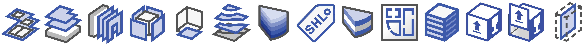
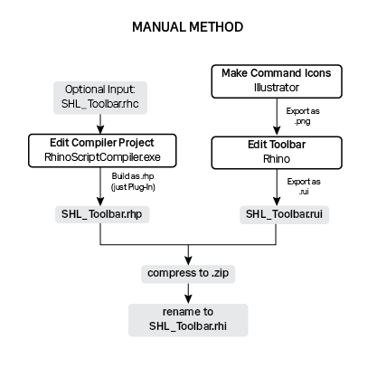
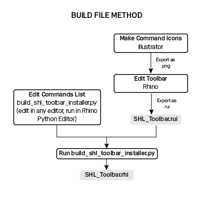

  
# SHL Toolbox  

**SHL Toolbox** is a set of workflow-enhancing tools for Rhino, with a particular focus on fabrication file preparation. Developed at [Schmidt Hammer Lassen Architects](https://www.shl.dk/), The toolbox is deployed as an IronPython plugin for Rhino and uses the [rhinoscriptsyntax](https://developer.rhino3d.com/api/RhinoScriptSyntax/) and [RhinoCommon](https://developer.rhino3d.com/guides/rhinocommon/) libraries.


## Getting Started

- Clone the ```shl-toolbox``` repo to your local scripts folder. This is usually located at:
```
C:\Users\[YOUR_USER_NAME]\AppData\Roaming\McNeel\Rhinoceros\6.0\scripts
```
If you do not have a scripts directory, add one yourself to the 6.0 directory.

- You can now edit the commands in ```shl-toolbox/commands``` in the editor of your choice and test them by running them directly in the Rhino Python script editor.

***Notes on local paths:  
- Scripts shlMakeBox.py and shlMakeSlidingLidBox.py contain a local path to a logo hatch. Change this path to a desired solid-hatch logo to engrave on the box. See example files. ***
## Compiling

The goal of compilation is:
- ```SHL_Toolbar_Installer_Part_1.rhi```: Installs the commands and toolbar
- ```shl_toolbox_lib```: modules to be moved into the user's scripts directory  
  
An RHI file is a compressed archive of a Rhino Python Plugin (.rhp) and a Rhino Toolbar (.rui) file. 

#### 1. Export the .rui:
The .rui is edited and saved within Rhino. See McNeel's [toolbar documentation](http://docs.mcneel.com/rhino/5/help/en-us/toolbarsandmenus/customize_toolbars.htm) for more information. Ensure to update the version number before export by right-clicking the toolbar and editing > Properties > Group Name / Tab Text  
  


#### 2. Stage the commands before compiling:
Commands developed in ```/commands``` should reference the in-development library in ```/lib``` with imports formatted like so: 
  
```import shl-toolbox.lib.layers```  
  
However, when the plugin is compiled, the referenced library will exist in the user's scripts folder, ```USER\AppData\Roaming\McNeel\Rhinoceros\6.0\scripts\shl_toolbox_lib.``` Therefore, when compiling the project, you must copy the commands to be included in the plugin to ```\command_staging``` and change the imports like so:  

**BEFORE:** ```import shl-toolbox.lib.layers```  
**AFTER:** ```import shl_toolbox_lib.layers```  

#### 3. Build the Plugin Installer:

There are two ways to compile, manual compilations is described in case there are bugs in the process or the user is unclear on the automated method.  

  
**Manual Method:**
1. _Make the .rui:_  
  Create Toolbar buttons as necessary and save out the toolbar. The macros for each command should have the same name as the .py files representing the individual commands. When exporting the toolbar, be sure to edit the toolbar name to update the version number.
2. _Edit the .rhc and output a .rhp file:_    
a) A Rhino Compiler Project (.rhc) is read by ```\buildhelpers\RhinoScriptCompiler.exe``` to generate the .rhp file. In the repository, in ```/build``` you should find the most recent .rhc file, ```SHL_Toolbar.rhc```. Open ```RhinoscriptCompiler.exe``` and choose "Open an existing project." Here you can edit the existing .rhc by adding or removing commands, changing plugin setting, etc.  
b) Ensure to edit the plugin settings to update the version number.  
c) Build the project and chose "just Plug-In". ```SHL_Toolbar.rhp``` should be built in ```\build```  
3. _Compress the .rhp and .rui files_ into a .zip archive ```SHL_Toolbar.zip``` and change the file extension to ```SHL_Toolbar.rhi``` to make the installer.

  
**Automated Method:**  
```build_shl_toolbar_installer.py``` can be run from the Python editor in Rhino 6. This script contains variables for version number and filenames in ```\command_staging``` to target for building commands.  
Place the most updated .rui in ```\build``` and run the code to automatically build the .rhc file and the .rhi file.  Note that command names in Rhino will automatically be generated from the python filenames in ```\command_staging```. So, double check your .rui to make sure the command macro assigned to the toolbar button is correct!

#### 4. Make shl_toolbox_lib  
Simply move the files in ```\lib``` to a directory called ```\shl_toolbox_lib```, to be placed in the user's scripts directory. This can be automated if desired (e.g. with powershell) 


## Contacts

* **Sean Lamb** - *Developer v0.1-0.3* - [sean-nl](https://github.com/sean-nl)
* **Ali Mirakbari** - *Main contact* - [alimirakbari](https://github.com/alimirakbari)

https://github.com/SHLFab

## License

This project is licensed under the GNU Affero General Public License v3.0 - see the [LICENSE.md](LICENSE.md) file for details
